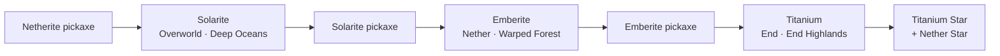

# Progression

TitanOres follows one line: each material is needed to reach the next one.

## Step by step

1. **Get a netherite pickaxe** (vanilla) and explore **deep ocean** biomes. Dig below **Y 16** to find
   [Solarite](solarite.md).
2. Craft **Solarite tools**. The **Solarite pickaxe** (harvest level 5) is the only way to mine
   [Emberite](emberite.md), found high in the Nether's **Warped Forest**.
3. Upgrade your Solarite tools to **Emberite** in a smithing table. The **Emberite pickaxe** (harvest level 6) mines
   [Titanium](titanium.md) inside the islands of the **End Highlands**.
4. Upgrade to **Titanium** gear: unbreakable tools with special abilities.
5. Kill withers, craft a **Titanium Star** and upgrade to **Titanium Star** gear, the final tier.

## Harvest levels

| Level | Pickaxe | Mines |
|---|---|---|
| 4 | Netherite (vanilla) | Solarite ore and block |
| 5 | Solarite | Emberite ore and block |
| 6 | Emberite | Titanium ore and block, Emberium block |
| 7 | Titanium / Titanium Star | everything |

Pickaxes from other mods with an equal or higher harvest level also work.

!!! warning "Wrong pickaxe = no drop"
    With a lower level pickaxe the ore still breaks (slowly) but **drops nothing**.
