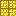

# Solarite

The first TitanOres material. A golden ore hidden deep below the ocean floor.

## Where & How

| Property | Value |
|---|---|
| Dimension | Overworld |
| Biomes | Deep Ocean, Deep Cold Ocean, Deep Lukewarm Ocean, Deep Frozen Ocean |
| Height | Y 0 – 16 |
| Vein size | up to 4 blocks (usually 1–3) |
| Frequency | 1 attempt every 2 chunks (rarer than diamond) |
| Replaces | stone, granite, diorite, andesite |
| Pickaxe needed | **Netherite** (level 4) or better |

!!! tip
    The deep ocean floor sits around Y 30–45, so Solarite is always buried well below it.

!!! info "Mine it yourself"
    - **No automation:** quarries, digital miners and builders (any fake player) cannot break this ore, and if a machine breaks it anyway it drops nothing.
    - **Explosion proof:** TNT and creepers cannot destroy the ore or its storage block (blast resistance 1200).
    - **Fire resistant:** every TitanOres item survives lava and fire.

## Processing

Smelt the ore to get an ingot (the blast furnace is twice as fast).

--8<-- "recipes/solarite_ingot_from_smelting.html"
--8<-- "recipes/solarite_ingot_from_blasting.html"

## Storage

--8<-- "recipes/solarite_block.html"
--8<-- "recipes/solarite_ingot_from_block.html"
--8<-- "recipes/solarite_nugget.html"
--8<-- "recipes/solarite_ingot_from_nuggets.html"

## Solarite Stick

Solarite tools use a special stick made from two ingots.

--8<-- "recipes/solarite_stick.html"

## Items

| Item | ID | Notes |
|---|---|---|
| { .mc-inline } Solarite Ore | `titanores:solarite_ore` | drops itself |
| { .mc-inline } Solarite Ingot | `titanores:solarite_ingot` | tag `forge:ingots/solarite` |
| { .mc-inline } Solarite Nugget | `titanores:solarite_nugget` | tag `forge:nuggets/solarite` |
| { .mc-inline } Solarite Dust | `titanores:solarite_dust` | tag `forge:dusts/solarite` (no recipe yet, for ore processing mods) |
| { .mc-inline } Block of Solarite | `titanores:solarite_block` | needs the same pickaxe as the ore |
