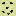
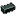

# Titanium

The endgame ore. Its ore and ingot are animated.

## Where & How

| Property | Value |
|---|---|
| Dimension | The End |
| Biome | End Highlands (outer islands) |
| Height | Y 16 – 56 |
| Vein size | up to 3 blocks |
| Frequency | 2 attempts per chunk (like ancient debris) |
| Replaces | end stone |
| Exposure | never touches air: dig inside the islands |
| Pickaxe needed | **Emberite pickaxe** (level 6) or better |

!!! tip
    Use `/locatebiome minecraft:end_highlands` after reaching the outer islands.

!!! info "Mine it yourself"
    - **No automation:** quarries, digital miners and builders (any fake player) cannot break this ore, and if a machine breaks it anyway it drops nothing.
    - **Explosion proof:** TNT and creepers cannot destroy the ore or its storage block (blast resistance 1200).
    - **Fire resistant:** every TitanOres item survives lava and fire.

## Processing

Smelt the ore to get an ingot (the blast furnace is twice as fast).

--8<-- "recipes/titanium_ingot_from_smelting.html"
--8<-- "recipes/titanium_ingot_from_blasting.html"

## Storage

--8<-- "recipes/titanium_block.html"
--8<-- "recipes/titanium_ingot_from_block.html"
--8<-- "recipes/titanium_nugget.html"
--8<-- "recipes/titanium_ingot_from_nuggets.html"

## Titanium Star

The upgrade material for the final gear tier. See [Special Items](items.md#titanium-star).

--8<-- "recipes/titanium_star.html"

## Items

| Item | ID | Notes |
|---|---|---|
| { .mc-inline } Titanium Ore | `titanores:titanium_ore` | drops itself |
| { .mc-inline } Titanium Ingot | `titanores:titanium_ingot` | tag `forge:ingots/titanium` |
| { .mc-inline } Titanium Nugget | `titanores:titanium_nugget` | tag `forge:nuggets/titanium` |
| { .mc-inline } Titanium Dust | `titanores:titanium_dust` | tag `forge:dusts/titanium` (no recipe yet, for ore processing mods) |
| { .mc-inline } Block of Titanium | `titanores:titanium_block` | needs the same pickaxe as the ore |
